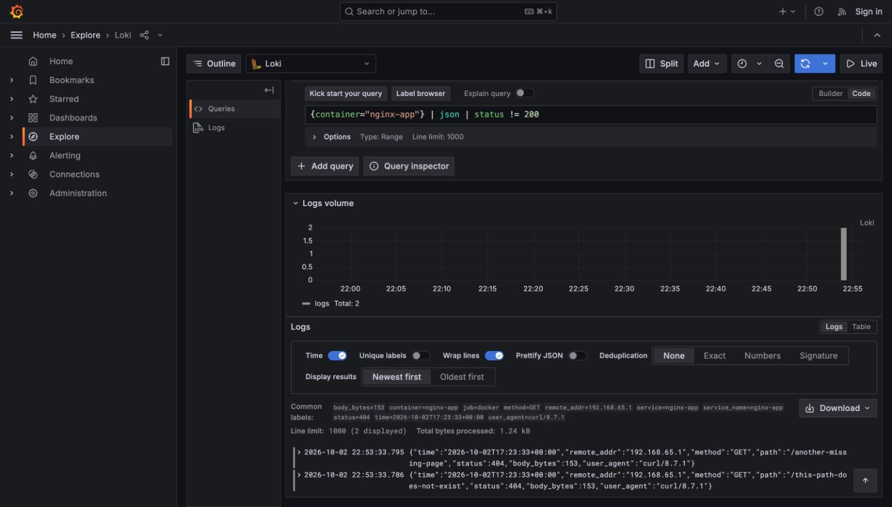

# Loki / Promtail / Grafana Setup (Task 6)

Status: **VERIFIED.** The stack was started, Promtail shipped NGINX logs into
Loki, and non-200 access logs were isolated with LogQL in Grafana Explore.
Every output below was actually observed.

## 1. Startup

```sh
# From the repository root.
docker compose up -d

# The app is not part of the compose file. Promtail discovers it over the
# Docker socket, so set the `service` label when starting it.
docker run -d --name nginx-app --label service=nginx-app \
  -p 8080:8080 devops-intern-final:local
```

Observed:

```
$ docker ps --format '{{.Names}}\t{{.Status}}\t{{.Ports}}'
grafana     Up 12 seconds        0.0.0.0:3001->3000/tcp
promtail    Up About a minute
loki        Up About a minute    0.0.0.0:3100->3100/tcp
nginx-app   Up About a minute (healthy)  0.0.0.0:8080->8080/tcp
```

| Service | URL |
| --- | --- |
| Loki | http://localhost:3100 |
| Grafana | http://localhost:3000 (3001 on this machine — see Problems) |
| App | http://localhost:8080 |

Grafana runs with anonymous admin access enabled (local only), so no login is
needed. Add Loki as a datasource once — either in the UI
(**Connections → Data sources → Add new data source → Loki**, URL
`http://loki:3100`, which is the compose service name and not `localhost`), or
via the API:

```sh
curl -s -X POST http://localhost:3000/api/datasources \
  -H "Content-Type: application/json" \
  -d '{"name":"Loki","type":"loki","access":"proxy","url":"http://loki:3100","isDefault":true}'
# observed: {"id":1,"name":"Loki","message":"Datasource added"}
```

## 2. Labels

Promtail uses `docker_sd_configs` to discover every running container and
relabels Docker metadata into these Loki labels:

| Label | Source | Observed value |
| --- | --- | --- |
| `job` | static, set by the scrape config | `docker` |
| `container` | `__meta_docker_container_name`, leading `/` stripped | `nginx-app` |
| `service` | `__meta_docker_container_label_service` | `nginx-app` |
| `nomad_alloc_id` | `__meta_docker_container_label_com_hashicorp_nomad_alloc_id` | `cc4ccbb9-f82a-a811-5db5-a7d5e285c781` |

Observed, after both a `docker run` container and a Nomad allocation were
running:

```
$ curl -s http://localhost:3100/loki/api/v1/labels | jq -c .
{"status":"success","data":["container","job","nomad_alloc_id","service","service_name"]}

$ curl -s http://localhost:3100/loki/api/v1/label/container/values | jq -c .
{"status":"success","data":["grafana","loki","nginx-app","promtail"]}

$ curl -s http://localhost:3100/loki/api/v1/label/nomad_alloc_id/values | jq -c .
{"status":"success","data":["cc4ccbb9-f82a-a811-5db5-a7d5e285c781"]}
```

`nomad_alloc_id` is best-effort by design: it is populated when Nomad started
the container and absent for a plain `docker run`. One scrape config covers
both. `service_name` is added automatically by Loki, not by our config.

NGINX writes access logs to stdout as JSON (see `app/nginx.conf`), which makes
`status` available to LogQL without a regex parser.

## 3. Queries

Generate a deliberate miss first:

```
$ curl -s -o /dev/null -w 'GET /this-path-does-not-exist -> HTTP %{http_code}\n' \
    http://localhost:8080/this-path-does-not-exist
GET /this-path-does-not-exist -> HTTP 404
```

In **Grafana → Explore → Loki**:

```logql
# All logs from the app container.
{container="nginx-app"}

# Access logs with a non-200 response status.
{container="nginx-app"} | json | status != 200

# Only logs from Nomad-managed allocations, non-200.
{nomad_alloc_id=~".+"} | json | status != 200
```

## 4. Results

### Non-200 access logs — observed

```
$ curl -sG http://localhost:3100/loki/api/v1/query_range \
    --data-urlencode 'query={container="nginx-app"} | json | status != 200' \
    --data-urlencode 'limit=10' | jq ...

stream labels: {"container":"nginx-app","job":"docker","service":"nginx-app"}
  {"time":"2026-10-02T17:23:33+00:00","remote_addr":"192.168.65.1","method":"GET","path":"/this-path-does-not-exist","status":404,"body_bytes":153,"user_agent":"curl/8.7.1"}
stream labels: {"container":"nginx-app","job":"docker","service":"nginx-app"}
  {"time":"2026-10-02T17:23:33+00:00","remote_addr":"192.168.65.1","method":"GET","path":"/another-missing-page","status":404,"body_bytes":153,"user_agent":"curl/8.7.1"}
```

The two deliberate 404s were isolated; the 200s were correctly excluded.

### Non-200 logs from the Nomad allocation — observed

```
$ curl -sG http://localhost:3100/loki/api/v1/query_range \
    --data-urlencode 'query={nomad_alloc_id=~".+"} | json | status != 200' ...

labels: {"container":"nginx-cc4ccbb9-f82a-a811-5db5-a7d5e285c781","job":"docker",
         "service":null,"nomad_alloc_id":"cc4ccbb9-f82a-a811-5db5-a7d5e285c781"}
  {"time":"2026-10-02T17:24:58+00:00","remote_addr":"172.17.0.1","method":"GET","path":"/this-path-does-not-exist","status":404,"body_bytes":153,"user_agent":"curl/8.7.1"}
```

This proves the full chain end to end: GHCR image → Nomad allocation → container
stdout → Promtail → Loki → LogQL.

### Grafana Explore screenshot



`docs/screenshots/grafana-explore-non200.jpg` — Explore running
`{container="nginx-app"} | json | status != 200`, logs volume showing
`Total: 2`, common labels including `status=404`, `container=nginx-app`,
`job=docker`, `service=nginx-app`, and both 404 lines.

## 5. Problems encountered and fixes applied

### Docker could not start any container (fixed)

`docker compose up -d` hung and the daemon dropped the connection:

```
Container loki Starting
error during connect: Post "http://.../containers/<id>/start": EOF
```

All three containers were left in `Created`, and even the app container, which
had been running for ten minutes, could no longer be restarted.

Diagnosis:

```
$ docker info --format '{{.MemTotal}}'
8217448448                  # Docker Desktop VM allocated 8.2 GB

$ top -l 1 -s 0 | grep PhysMem
PhysMem: 15G used (2097M wired, 4743M compressor), 141M unused.
```

A 16 GB host with ~141 MB unused and 4.7 GB compressed is swapping hard, so
the VM could not obtain the memory it was promised. Image *pulls* still worked,
which ruled out config and registry problems; restarting Docker Desktop alone
did not help, which ruled out a transient daemon fault.

**Fix:** capped the Docker Desktop VM at 4 GB (Settings → Resources → Memory)
and restarted it. 4 GB is ample for this stack.

```
$ docker info --format 'VM memory: {{.MemTotal}} bytes'
VM memory: 4108943360 bytes

$ docker run -d --name nginx-app ... && docker ps
nginx-app   Up 8 seconds (healthy)
```

Containers started normally from then on.

### Grafana port 3000 already in use (worked around)

```
Error response from daemon: ports are not available: exposing port TCP
0.0.0.0:3000 -> 127.0.0.1:0: listen tcp 0.0.0.0:3000: bind: address already in use

$ lsof -nP -iTCP:3000 -sTCP:LISTEN
node    44492 neel   17u  IPv6 ... TCP *:3000 (LISTEN)
```

An unrelated Node application on this machine owns port 3000.

**Fix:** `docker-compose.yaml` keeps the conventional `3000:3000`, since a
reviewer's machine will normally have it free. Locally, an uncommitted
`docker-compose.override.yaml` (gitignored) remaps it:

```yaml
services:
  grafana:
    ports: !override
      - "3001:3000"
```

The `!override` tag matters: Compose **merges** list fields by default, so a
plain override appends `3001:3000` to the existing `3000:3000` and the conflict
persists. `!override` replaces the list instead.

### Promtail would not have labelled the app by service name (fixed)

`docker run` sets no Compose labels, so relabelling from
`com.docker.compose.service` would have produced an empty `service` label.

**Fix:** relabel from a plain `service` Docker label, and document
`--label service=nginx-app` as part of the run command.

### Status filtering would have needed fragile regex (fixed)

The default NGINX combined log format is not machine-readable.

**Fix:** emit JSON access logs, so LogQL uses `| json | status != 200`
directly.
